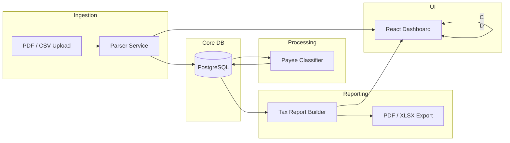

# LedgerFlow – Project Overview
_Last updated: 2025-04-24_

## Mission
Provide a **self-hosted, safety-first bookkeeping platform** that ingests PDFs & CSVs, classifies payees, and produces tax-ready reports – all running in Docker with bullet-proof backup / restore.

## Why LedgerFlow Exists
Small-business owners and freelancers juggle banks, credit cards, PDFs and CSVs.  
LedgerFlow ingests **bank statements + receipts**, classifies every payee, and spits out **tax-ready reports** – all on-prem (or self-hosted) so data never leaves the owner's laptop.

## High-Level Workflow

## Milestones (Q2 2025)

| ID | Goal | Target | Owner |
|----|------|--------|-------|
| M-01 | **Prod bootstrap** using image `v20250424`, first backup succeeds | 30 Apr | PM-Guardian |
| M-02 | Hourly backup container & size-check alerting in prod | 05 May | DB Guardian |
| M-03 | Restore-smoke job wired into CI / PR gate | 09 May | Reviewer + DB Guardian |
| M-04 | PDF parser integrated into Django `documents` app | 15 May | Full-Stack Dev |
| M-05 | Payee-classifier baseline accuracy ≥ 75 % | 22 May | Task-force |
| M-06 | Minimal UI dashboard (React + Tailwind) deployed | 31 May | UI Specialist |

> **Definition of done** for every milestone: _code merged → CI green → backup + restore smoke-test pass → docs updated_.

## Tech Stack

| Layer | Tech | Notes |
|-------|------|-------|
| Containers | Docker Compose (dev + prod) | Wrapper ledger_docker enforces safety |
| Backend | Python 3.12, Django 5.2, DRF | Hot-reload in dev |
| DB | PostgreSQL 17.4 | Hourly + daily backups, restore-smoke CI |
| AI/NLP | sentence-transformers, scikit-learn | Local embeddings – no external API calls |
| Front-end | React + Tailwind + shadcn/ui | Served by Django templates or Vite build |
| CI/CD | GitHub Actions | Lint → test → build → restore-smoke |
| Backups | iCloud mount ~/iCloudLedger | Size check > 10 KB, integrity test |

## Repositories

| Repo | Purpose | Default Branch |
|------|---------|----------------|
| **ledgerflow-app** | Django backend, React frontend, domain logic | `main` |
| **ledgerflow-infra** | Dockerfiles, docker-compose, GH Actions, Helm (future) | `main` |
| **ledgerflow-archive** | Long-term backups (iCloud mount) – _not public_ | n/a |

## Environment Configuration

### Development
- URL: http://localhost:9001
- Features: volume mounts, DEBUG on
- Command: `make dev`

### Production
- URL: http://localhost:9000 (or behind reverse-proxy)
- Features: protected volumes, DEBUG off
- Environment separation via .env.dev / .env.prod
- Gold-copy templates and guard hooks prevent secret leakage

## Non-Code Assets

* **iCloudLedger** → `~/iCloudLedger` symlink (backups & gold-copy envs)  
* Docker volumes  
  * `ledger_dev_db_data` (protected)  
  * `ledger_prod_db_data` (protected)
* Slack workspace **ledgerflow-dev**  
* PagerDuty service **LedgerFlow-Critical** 